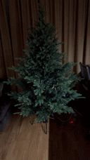
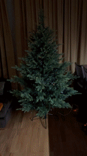
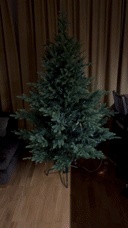
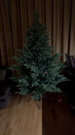
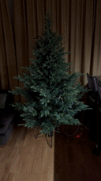
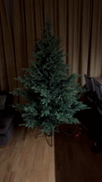
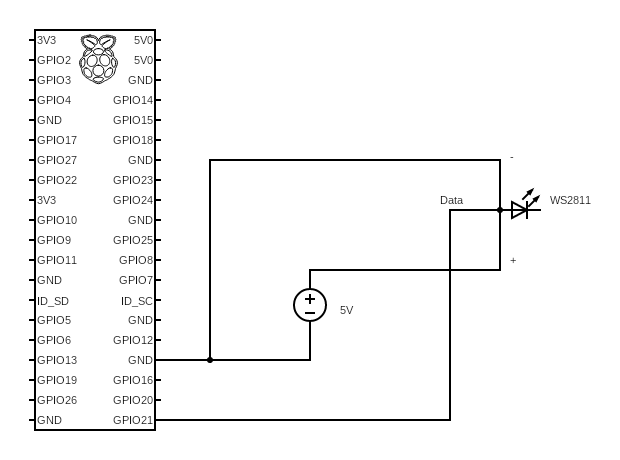
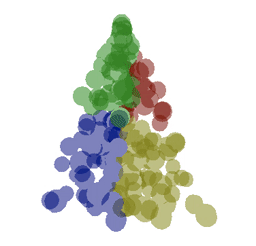

# christmas-tree

This is a project implementing controllable Christmas lights. Inspired by Matt Parker
(<https://www.youtube.com/watch?v=TvlpIojusBE>), this repo includes code to measure the 3D coordinates of the addressable
RGB LED Christmas lights and to display various effects using the calculated coordinates.

  

  

# Table of Contents
- [Setup](#setup)
    - [Settings](#settings)
    - [Wiring](#wiring)
- [Features](#features)
- [3D Coordinate capturing/calculation](#3d-coordinate-capturing-and-calculation)
    - [Theory](#theory)
    - [Practice](#practice)
- [Writing Effects](#writing-effects)
    - [Static Effects](#static-effects)
- [Simulating Effects](#simulating-effects)
- [Running Effects](#running-effects)
- [Intended Workflow](#intended-workflow)
    - [Capturing the images](#capturing-the-images)
    - [Calculating the 3D coordinates](#calculating-the-3d-coordinates)
    - [Running the server](#running-the-server)


## Setup

The project uses [Poetry](https://python-poetry.org/docs/#installation) for dependency management. The dependencies are
split into three groups:

- `camera` - dependencies related to capturing the LEDs and saving them as frames for later post-processing
- `calculations` - dependencies related to computing the 3D LED coordinates from the captured images, as well as running
effect simulations
- `rpi` - dependencies related to displaying the effects using the Raspberry Pi ('prod' usage)

Note that on the Raspberry Pi you might need to install the dependencies with `sudo`, which means that Poetry might not be usable
(this happened to me). For this, you can use the `requirements.txt` file under `christmas_tree/rpi` to install the Raspberry Pi
dependencies.

To install a specific dependency group run `poetry install --with <group>`. For example, to install the dependencies for capturing the LEDs
as frames, run `poetry install --with camera`.

### Settings

A global settings module can be found at `christmas_tree.common.settings` - update the number LEDs and the (local) IP of your
Raspberry Pi inside there.

### Wiring

See my wiring in the image below. What's important is to not power the LEDs from the Raspberry Pi but to have a dedicated power supply.
Also, I had to power the LED chain in multiple places for the LED brightness/color not to fall off too much due to internal resistance.

I used the `D21` GPIO pin for the LED data channel, if that does not work for you try the other pins.



## Features

In this repo, you can find code that allows you to:

- capture and calculate the 3D coordinates of each LED
- run effect simulations - this way, even before you hook up the lights on a tree you can start developing effects in advance
- run the actual effects using a Raspberry Pi

## 3D Coordinate Capturing and Calculation

To display effects on the Christmas tree, we need to compute/approximate the 3D coordinates of each LED. The idea is that
we can capture an image for each LED lit up in isolation - in my case of 500 LEDs this will generate 500 images. However,
capturing the images from one direction means that some LEDs will be obstructed (not visible), also, the depth dimension is lost.

### Theory

To get a better approximation of the coordinates we repeat the image capturing from multiple angles. If, for each LED, we
capture the LED from `N` different angles, and measure where in each frame the LED appears, we can approximate the LED's
x, y and z coordinates with:

```math
x = \frac{1}{N}\sum_{n=1}^{N} u_n\dot\cos\Theta_n
```
```math
y = \frac{1}{N}\sum_{n=1}^{N} v_n
```
```math
z = \frac{1}{N}\sum_{n=1}^{N} u_n\dot\sin\Theta_n
```

here, $\Theta$ is the angle at which an LED was captured, $u$ is the horizontal and $v$ is the vertical coordinate of the LED
as it appears in the frame. Note that $u$ and $v$ should be in the real number (not pixel) space, where the origin is the center
of the frame (as opposed to the top-left or top-right corner as is usual in computer graphics).

### Practice

What worked in my case is setting up the camera (laptop) in one place and adding four markers around the base of the
Christmas tree in 90 degree increments. This way you can capture the LEDs from 8 positions (N, W, S, E, NW, SW, SE, NE)
by rotating the tree.

## Writing effects

Effects are Python functions decorated with an `@effect` decorator. The decorator accepts an optional effect name (for displaying in the web UI).

The effect functions should accept two parameters - `pixels` and `coords`. The `pixels` arguments is the `neopixel.NeoPixel` object and holds the RGB values of every LED - `i`-th LED's color is `pixels[i]`. `coords` are the coordinates of the LEDs as a dict - the `i`-th LED's x, y, z coordinates are `coords[i]`.

Here is an example effect which creates a sphere expanding and shrinking continuously.

```python
@effect(name="Expanding/shrinking sphere")
def expanding_ball(pixels, coords):
    color = np.random.randint(0, 256, 3)
    start = time.time()
    while True:
        t = time.time() - start
        radius = np.abs(np.sin(t))

        for i in coords:
            x, y, z = coords[i]
            if x**2 + y**2 + z**2 <= radius**2:
                pixels[i] = tuple(color)
            else:
                pixels[i] = (0, 0, 0)

        pixels.show()
        time.sleep(0.01)
```

### Static effects

Due to implementation reasons, effects that don't have an infinite loop running, should have a blocking call inside them. See examples, e.g. `christmas_tree.common.effects.ua_flag`.

## Simulating effects

  

Effect simulation can be useful if you don't have the Christmas lights set up yet but want to start working on the effects.
This repo provides a way to simulate the effects by utilizing Three.js bindings for Python under-the-hood.
Long story short, effects written for the simulated lights can be used as-is with the real Christmas lights. The logic will
stay the same and you won't have to do any refactoring when moving from the simulated to the real tree.

See an example here: <https://github.com/Asa-Nisi-Masa/christmas-tree/blob/master/christmas_tree/calculations/simulation.ipynb>


## Running effects

Effects can be run from a script with, for example:

```python
import board
import neopixel

from christmas_tree.common.effects.colored_wave import colored_wave
from christmas_tree.common.utils import load_coordinates

pixels = neopixel.NeoPixel(board.D21, 50, auto_write=False, pixel_order=neopixel.RGB, brightness=0.2)

coords = load_coordinates("coordinates.csv")

pixels.fill((0, 0, 0))
pixels.show()

colored_wave(pixels, coords)
```

or by making requests to a web server. A Flask server is included which allows you to
select one or more effect to be displayed. If one effect is selected, it will run indefinitely. If multiple effects are
selected, they will be cycled-through indefinitely, with each of them being shown for some duration (see [Running the server](#running-the-server) below).


## Intended Workflow

### Capturing the images

With the Christmas lights on the tree and camera set up, calibrate/tilt the camera so that the center of the frame aligns
with the center of the tree:

```bash
poetry run python3 -m christmas_tree.camera.calibrate
```

Start the server on your Raspberry Pi with

```bash
sudo python3 -m christmas_tree.rpi.server
```

and update the Pi's local network URL in the `christmas_tree.camera.capture_frames` module.

When ready, turn off the lights and capture the first set of images for the angle of 0 degrees (using your laptop/webcam driver):

```bash
poetry run python3 -m christmas_tree.camera.capture_frames 0
```

Rotate the tree by X degrees (from the initial orientation) and repeat the same:

```bash
poetry run python3 -m christmas_tree.camera.capture_frames X
```

Repeat the process for multiple angles.

### Calculating the 3D coordinates

Calculate the coordinates from the frames captured with

```bash
poetry run python3 -m christmas_tree.calculations.compute_coords
```

The script will inform you if there are any LEDs whose positions could not be determined. If that happens, play around
with the parameters at the top of the script. The script will generate a `coordinates.csv` file at the root of the repo.

### Running the server

On your Raspberry Pi, run

```bash
sudo python3 -m christmas_tree.rpi.server
```

then visit <http://0.0.0.0:5000/> on your local computer, select the effects you want to be shown and click `Submit`.
